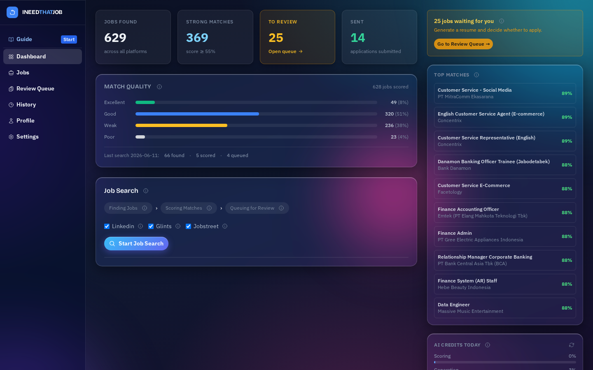
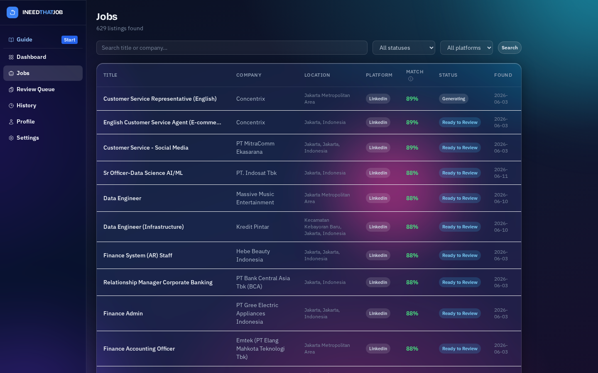
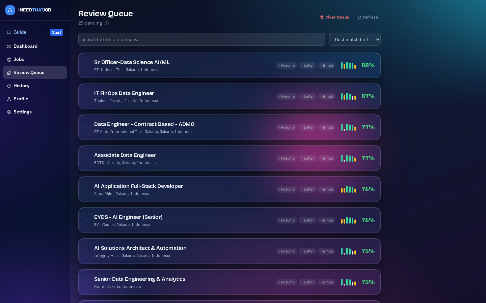
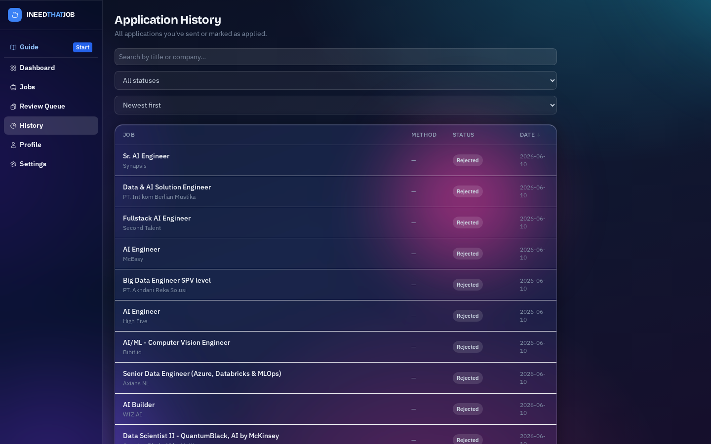
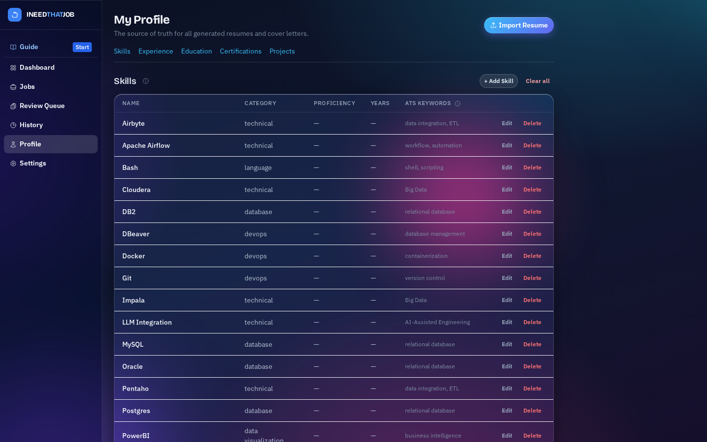
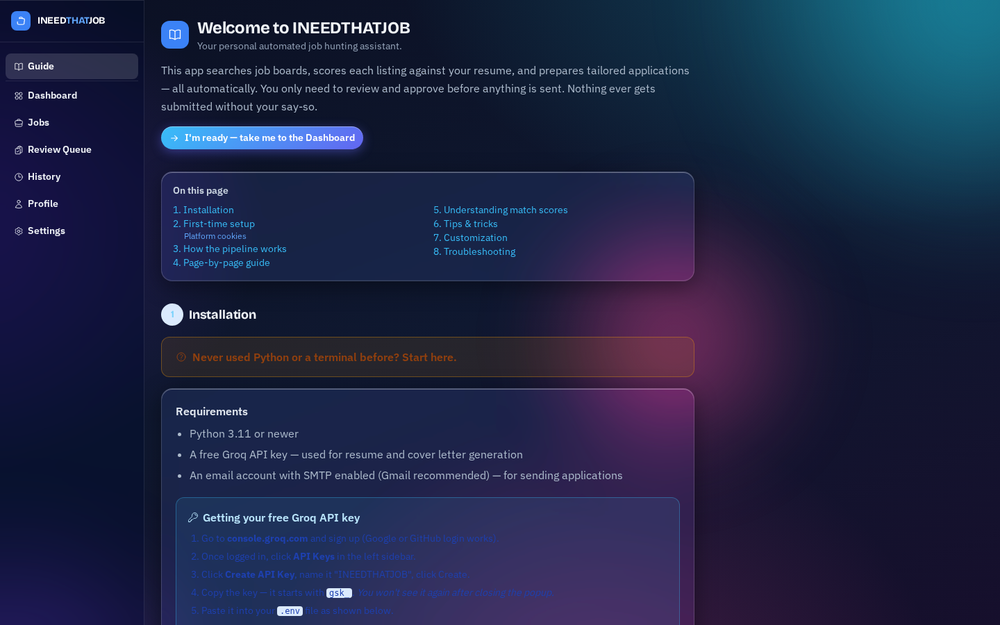

# INEEDTHATJOB

An automated job application assistant for the Indonesian job market. Point it at your resume, tell it what roles you want, and it finds, scores, and prepares applications — you just review and approve before anything gets sent.

**Supported platforms:** LinkedIn · Glints · JobStreet

---

## What it does

1. Scrapes job listings that match your target roles
2. Scores each listing against your profile (skills, experience, title, location, salary)
3. Queues high-scoring jobs in a review dashboard
4. Generates a tailored resume, cover letter, and email per job on demand
5. Sends applications via SMTP after your explicit approval

Nothing is submitted automatically. Every application requires a human click.

---

## Screenshots

**Dashboard** — pipeline status, match quality, and one-click job search


**Jobs** — every scraped listing with scores, search, and filters


**Review Queue** — generated resume, cover letter, and email per job; approve & send from one card


**History** — every application sent, skipped, or failed


**Profile** — the skills, experience, and education the generator draws from


**Settings** — schedule, API key, email, and platform cookies


**Guide** — built-in setup walkthrough for non-technical users


---

## Requirements

- Python 3.11+
- A [Groq API key](https://console.groq.com) (free tier is sufficient)
- An email account with SMTP access (Gmail recommended) — only needed to send applications

---

## Installation

### Never used Python or a terminal before?

**Windows:**
1. Go to **python.org/downloads** and click the big yellow "Download Python 3.x.x" button.
2. Run the installer. **Important:** check the box that says **"Add Python to PATH"** before clicking Install.
3. Press **Win + R**, type `cmd`, press Enter — that's your terminal.
4. Navigate to the app folder: `cd %USERPROFILE%\Desktop\INEEDTHATJOB` (adjust path as needed).

**macOS:**
1. Open **Terminal** (Cmd+Space → type "Terminal" → Enter).
2. Type `python3 --version` — if you see a version number, Python is installed. If not, download from python.org.
3. Type `cd ` (with a space), then drag the INEEDTHATJOB folder from Finder into Terminal. Press Enter.

---

### Setup steps

**1. Get a Groq API key (free)**

1. Go to **console.groq.com** and sign up (Google or GitHub login works).
2. Click **API Keys** in the left sidebar → **Create API Key** → name it "INEEDTHATJOB" → Create.
3. Copy the key — it starts with `gsk_`. You won't see it again after closing the popup.

**2. Install and configure**

```bash
# Install dependencies
pip install -r requirements.txt

# Install the browser used for assisted login and auto-apply
playwright install chromium
```

Then either:
- Create a file named `.env` in the app folder and add `GROQ_API_KEY=gsk_your_key_here`
- **Or** start the app first and enter the key in Settings → Groq API Key (no file editing needed)

**3. Start the app**

```bash
python main.py
# On Mac, use: python3 main.py
```

Open **http://localhost:8000** in your browser. Leave the terminal window open while using the app — closing it stops the server.

---

## First-time setup

After starting the app, do these four things:

**A. Import your resume** → Profile page  
Upload your existing resume (PDF or DOCX). The app reads your skills, experience, and education from it. You can also add/edit manually after importing.

**B. Set target roles** → Settings page  
Tell the app which job titles to search for. Be specific: "Finance Staff", "Accounting Officer", "Tax Specialist". The app only fetches listings that match these titles. Also set locations and minimum salary.

**C. Configure email** → Settings → Email (SMTP)  
Needed only to send applications automatically. You can skip this and apply manually.

**Gmail (recommended):**
1. Go to **myaccount.google.com → Security** and enable **2-Step Verification**.
2. Under Security, find **App passwords**.
3. Select app: *Mail*, device: *Other* → type "INEEDTHATJOB" → click **Generate**.
4. Copy the 16-character password. Your regular Gmail password will not work here.
5. In Settings → Email (SMTP), enter:
   - Host: `smtp.gmail.com` · Port: `587`
   - Username & From Email: your Gmail address
   - Password: the 16-character app password

**Outlook / Hotmail:**
- Host: `smtp.office365.com` · Port: `587`
- Username & Password: your Outlook credentials

**Other providers:** search "*your provider* SMTP settings" — every major service has a help page.

**D. Add platform cookies** → Settings → Platform Cookies  
The scraper browses job sites as you — it needs your login session. See below.

---

## Platform cookies

A session cookie is proof that you're logged in. The scraper uses it to fetch listings as if you were browsing normally. Takes about 2 minutes per platform.

**Steps (same for all platforms):**
1. Open the platform site and log in.
2. Press **F12** to open DevTools (or right-click → Inspect).
3. Click the **Application** tab (Chrome/Edge) or **Storage** tab (Firefox).
4. In the left sidebar: **Cookies** → click the site URL.
5. Find the cookie name, click its row, copy the **Value** column.
6. Paste it into Settings → Platform Cookies.

| Platform | Cookie name | Site |
|----------|-------------|------|
| LinkedIn | `li_at` | linkedin.com |
| Glints | `token` | glints.com |
| JobStreet | `JobseekerSessionToken` | id.jobstreet.com |

Cookies expire after 30–90 days or when you log out. If scraping returns 0 results, refresh your cookies. They are saved only to `.env` on your machine — never sent anywhere.

---

## How the pipeline works

Click **Start Job Search** on the Dashboard. The app runs:

| Step | What happens |
|------|-------------|
| ① Find Jobs | Scrapes LinkedIn, Glints, JobStreet for listings matching your target roles |
| ② Fetch Details | Opens each listing to get the full job description |
| ③ Score Matches | Rates each job 0–100% based on skills, experience, title, location, salary, language |
| ④ Queue Top Picks | Jobs scoring ≥ 55% are added to your Review Queue |

> **Nothing is sent automatically.** After the pipeline, you review each job and click Generate + Approve before anything goes out.

---

## Match scores

| Factor | Weight | Description |
|--------|--------|-------------|
| Skill match | 35% | How many of your skills appear in the job description |
| Experience | 25% | Whether your years of experience meets the requirement |
| Title relevance | 20% | Whether the job title matches your target roles |
| Location | 10% | Whether the job location matches your preferences |
| Language | 5% | Whether the posting language matches your preference |
| Salary | 5% | Whether the stated salary meets your minimum |

| Score | Label | Meaning |
|-------|-------|---------|
| ≥ 75% | Excellent | Strong fit — apply |
| 55–74% | Good | Worth reviewing |
| 35–54% | Weak | Not queued |
| < 35% | Poor | Skip |

---

## Tips

**Add ATS keywords to your skills.** Each skill on the Profile page has a keywords field. Add synonyms and abbreviations: for "Microsoft Excel", add `Excel, spreadsheet, vlookup, pivot table`. More keywords = better skill matching.

**Specific achievements generate better resumes.** Add metric-driven bullets under each experience: "Reduced monthly close time by 2 days by automating reconciliation." The AI picks the most relevant ones — it won't invent numbers.

**Generate resume before cover letter.** The cover letter reads the resume content and produces a more coherent package.

**Schedule daily searches.** Settings → Auto-Schedule. Default (`0 9 * * 1-5`) runs every weekday at 9 AM.

**Score too low?** Click the job to see the sub-score breakdown. Low Skill Match = add the job's exact terms to your skill keywords.

---

## Customization

**Change the score threshold** — open `pipeline.py`, change `MIN_SCORE_TO_GENERATE = 0.55`.

**Adjust scoring weights** — open `jobs/scorer.py`, edit the `WEIGHTS` dict (values must sum to 1.0):
```python
WEIGHTS = {
    "skill_match":      0.35,
    "experience_match": 0.25,
    "title_relevance":  0.20,
    "location_match":   0.10,
    "language_match":   0.05,
    "salary_match":     0.05,
}
```

**Swap the AI model** — add to `.env`:
```
GENERATION_MODEL=llama-3.3-70b-versatile
SCORING_MODEL=llama-3.1-8b-instant
```
Check **console.groq.com** for available models and rate limits.

**Edit generation style** — all prompts are plain text files in `generation/prompts/`. Edit them to change tone or language — no Python needed.

---

## Troubleshooting

**Review Queue is empty after running the pipeline**  
Two causes: (1) No jobs scored ≥ 55% — add ATS keywords to your skills and broaden target roles. (2) Target roles too narrow — try adding variants like "Accounting Staff", "Staff Keuangan", "Finance Admin".

**Jobs list is empty**  
Pipeline hasn't run yet, or scraper found no matching titles. Click Start Job Search. If it returns 0 jobs, check that target roles in Settings are spelled correctly.

**SMTP test fails with authentication error**  
For Gmail: use an App Password, not your regular password. Google Account → Security → App passwords → Generate. Your regular password will not work.

**Generated resume looks wrong**  
The AI only uses data from your Profile. Update your Profile first, then click Generate Resume again — it overwrites the previous version.

**Pipeline stops or freezes**  
Click Stop on the Dashboard. Already-fetched descriptions are cached, so re-running won't re-fetch.

**App won't start / import errors**  
Run `pip install -r requirements.txt` again. For database errors, delete the `.db` file in `data/` and restart — the app recreates it (existing data will be lost).

**"Playwright not available" when clicking a Log in button**  
Run `pip install -r requirements.txt` and `playwright install chromium`, then restart the app from the same terminal.

---

## Configuration

Key `.env` values:

| Key | Default | Description |
|-----|---------|-------------|
| `GROQ_API_KEY` | — | Required. Get from console.groq.com |
| `GENERATION_MODEL` | `llama-3.3-70b-versatile` | Model for resumes and cover letters |
| `SCORING_MODEL` | `llama-3.1-8b-instant` | Model for bulk scoring |
| `SCHEDULE_ENABLED` | `false` | Auto-run pipeline on cron |
| `SCHEDULE_CRON` | `0 9 * * 1-5` | Weekdays 9 AM |
| `MIN_SCORE_TO_GENERATE` | 0.55 | Edit in `pipeline.py` |

---

## License

MIT
